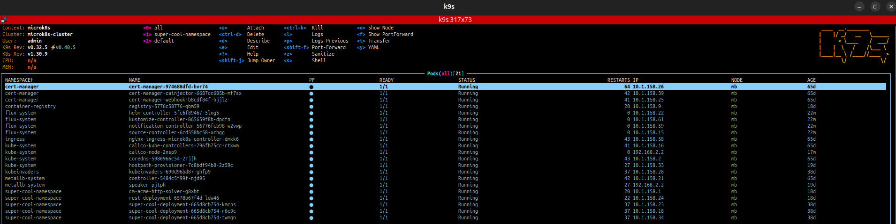

# fluxcd-setup

## Tasks

- kubernetes cluster
- FluxCD bootstrap on my cluster
- Install vector inside the cluster using flux, output some logs
- Opting to skip PLG stack because I did that for another interview: https://github.com/markus-brln/prometheus-grafana-setup

## Install lightweight kubernetes distro

- Kubernetes distro choice:
  - Already have experience with microk8s, so don't want to re-invent the wheel
  - Looked at other distros, but didn't want to do a full analysis with POCs for this task

```bash
sudo snap install microk8s --classic --channel=1.31/stable
```

- How do I determine versions? At the company we take the second-to-last major version / take an LTS
  - New features, new bugs
  - Still patch releases

## Bootstrap FluxCD


- Follow GitHub-specific guide: https://fluxcd.io/flux/installation/bootstrap/github/
- Make GitHub access token: https://github.com/settings/tokens
  - Scoped to just this project (apparently a new feature in GitHub)
  - A word on token expiry: In our company it became a problem that we needed so many different tokens for our gitops
    pipeline and gitlab wouldn't allow creating tokens with an expiry for longer than a year -> operational load, toil
    - Now you can make bot users with tokens that don't expire, which is also suboptimal. I wished we had enough time to
      automate this

Install flux CLI:

- Check that prerequisites are met: https://fluxcd.io/docs/installation/#prerequisites
  - When I did this at work I realized our current kubernetes version (1.28) wasn't supported by the latest flux
    version, so I needed to use an older flux version

```bash
curl -s https://fluxcd.io/install.sh | sudo bash
```

- Verify installation `flux --version`
- Start k9s to see what's happening in the cluster on bootstrap

Bootstrap command (https://fluxcd.io/flux/installation/bootstrap/github/#github-personal-account):

```bash
flux bootstrap github \
  --token-auth \
  --owner=markus-brln \
  --repository=fluxcd-setup \
  --branch=main \
  --path=flux-manifests \
  --personal
```

Errors:

```yaml
 Warning  FailedCreatePodSandBox  3m20s                 kubelet            Failed to create pod sandbox: rpc error: code = Unknown desc = failed to setup network for sandbox "f72243dfc0904c1cd1d4ccf2481ecb17f324bfde4f3a1b01628f2d5bd8fda8c3": plugin type="calico" failed (
add): error getting ClusterInformation: connection is unauthorized: Unauthorized
```

- Saved the error logs, turned out to be very helpful in the past, especially for incidents
- Asked copilot and the internet a bit, seemed to agree that I'd just need to restart the calico node pod
  - Matches my prio experience of microk8s in general having some issues when rebooting the host machine
  - On staging or production I'd think about this twice, but on local it's fine
  - That did the trick, flux workloads were scheduled

Output of flux bootstrap
- I think I got a timeout because of the scheduling issues
- But I also got `all components are healthy`



```bash
► connecting to github.com
► cloning branch "main" from Git repository "https://github.com/markus-brln/fluxcd-setup.git"
✔ cloned repository
► generating component manifests
✔ generated component manifests
✔ committed component manifests to "main" ("4a50ea7982ba8e69beb535b58bdfcc72b4ffac4d")
► pushing component manifests to "https://github.com/markus-brln/fluxcd-setup.git"
► installing components in "flux-system" namespace
✔ installed components
✔ reconciled components
► determining if source secret "flux-system/flux-system" exists
► generating source secret
► applying source secret "flux-system/flux-system"
✔ reconciled source secret
► generating sync manifests
✔ generated sync manifests
✔ committed sync manifests to "main" ("50ba499d1c853fc5d150ab96dbe33b8cc073c59a")
► pushing sync manifests to "https://github.com/markus-brln/fluxcd-setup.git"
► applying sync manifests
✔ reconciled sync configuration
◎ waiting for GitRepository "flux-system/flux-system" to be reconciled
✗ context deadline exceeded
◎ waiting for Kustomization "flux-system/flux-system" to be reconciled
✗ client rate limiter Wait returned an error: context deadline exceeded
► confirming components are healthy
✔ helm-controller: deployment ready
✔ kustomize-controller: deployment ready
✔ notification-controller: deployment ready
✔ source-controller: deployment ready
✔ all components are healthy
✗ bootstrap failed with 2 health check failure(s): [error while waiting for GitRepository to be ready: 'context deadline exceeded', error while waiting for Kustomization to be ready: 'client rate limiter Wait returned an error: context deadline exceeded']
```

I think I don't need to re-run the command or anything because the components are running and healthy and the pods
don't have any error logs - I'll just try to commit something to the repo and see if it gets picked up

Flux also successfully added its components to my repo: https://github.com/markus-brln/fluxcd-setup/tree/main/flux-manifests/flux-system

Adding a simple test namespace was successful, got picked up by the source controller

```json
{
  "level": "info",
  "ts": "2025-02-21T10:35:40.716Z",
  "msg": "stored artifact for commit 'test namespace, more readme'",
  "controller": "gitrepository",
  "controllerGroup": "source.toolkit.fluxcd.io",
  "controllerKind": "GitRepository",
  "GitRepository": {
    "name": "flux-system",
    "namespace": "flux-system"
  },
  "namespace": "flux-system",
  "name": "flux-system",
  "reconcileID": "da81524a-5e68-44dc-b3c4-6a65e1451381"
}
```

## Uninstall FluxCD

```bash
flux uninstall
```

Remove binary from `/usr/local/bin/flux` (check `which flux`)


## Vector

First needed to read about what vector does and how it works

Following https://vector.dev/docs/setup/installation/platforms/kubernetes/

```bash
helm repo add vector https://helm.vector.dev
helm repo update
helm show values vector/vector
```

- Made a quick helm chart for faster development, otherwise I'd need to commit every small change and run a flux
  reconcile every time, like this it's just:

```bash
helm dependency build ./charts/vector  # once
helm upgrade --install vector ./charts/vector \
  -f ./charts/vector/values.yaml \
  --namespace vector \
  --create-namespace
helm uninstall vector --namespace vector
```

- Did a `helm show values vector/vector > charts/vector/values.yaml` so I can go through all values and see what I need
  to change
- Deployed first with default values before changing anything, so I can do incremental changes from here
- Found out that I probably only need to change `customConfig` with sources and sinks

